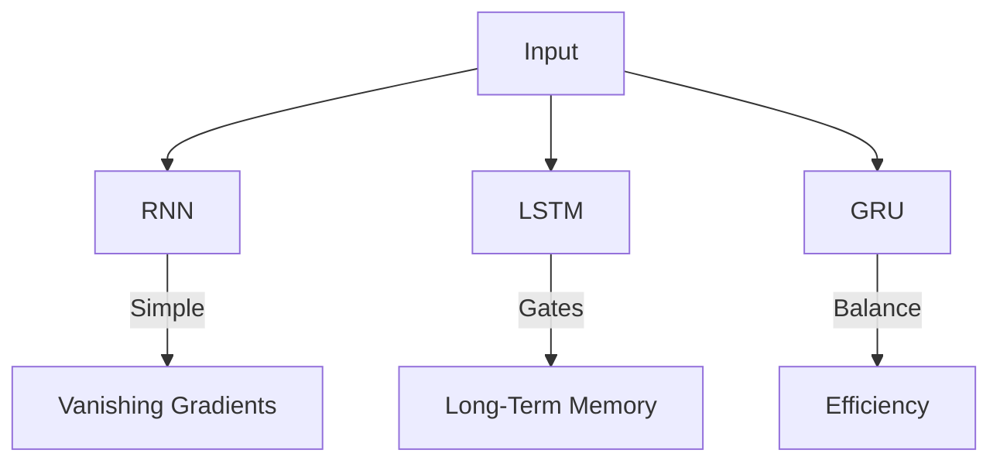
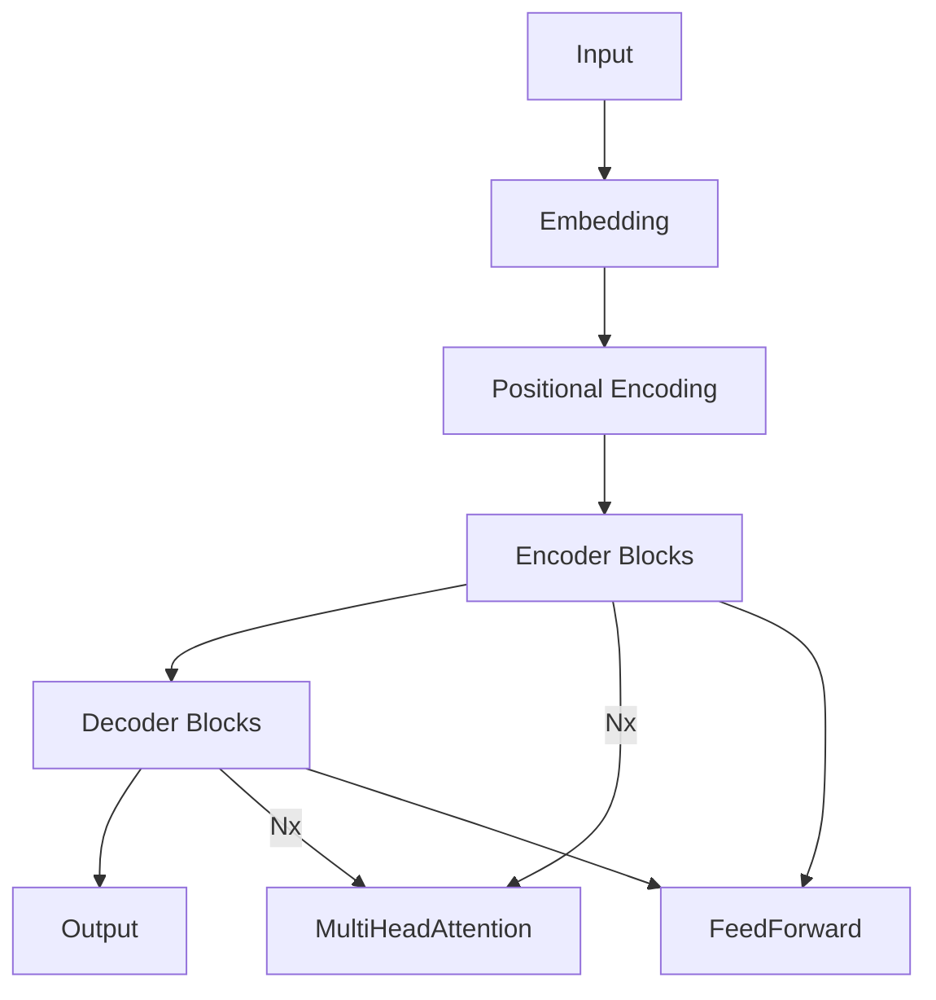
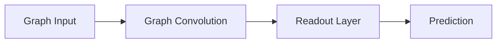

# **Advanced Architectures in PyTorch**

#### *`Mastering Modern Deep Learning Designs`*

## **Why Study These Architectures?**

> "The architecture you choose encodes your assumptions about the world." - Yann LeCun

This chapter explores specialized neural designs for different data types:

- **Grid data** (images, videos) → CNNs
- **Sequential data** (text, time series) → RNNs
- **Relational data** (social networks, molecules) → GNNs
- **Universal architectures** → Transformers

## **Chapter Topics Breakdown**

### **6.1 Convolutional Neural Networks (CNNs)**

**Core Idea**: Spatial feature hierarchies

```python
# PyTorch Implementation
model = nn.Sequential(
    nn.Conv2d(3, 16, kernel_size=3, stride=1),  # (B,3,H,W) → (B,16,H,W)
    nn.ReLU(),
    nn.MaxPool2d(2),                            # → (B,16,H/2,W/2)
    nn.Conv2d(16, 32, kernel_size=3),
    nn.AdaptiveAvgPool2d(1)                     # → (B,32,1,1)
)
```

**Key Innovations**:

- Residual connections (ResNet)
- Depthwise separable convolutions
- Dynamic convolutions

### **6.2 Recurrent Neural Networks (RNNs/LSTMs/GRUs)**

**Core Idea**: Temporal state propagation

```python
# LSTM for sequence prediction
lstm = nn.LSTM(input_size=10, hidden_size=20, num_layers=2)
output, (h_n, c_n) = lstm(input_sequence)  # input: (seq_len, batch, features)
```

**Advanced Variants**:

- Bidirectional RNNs
- Attention-augmented RNNs
- Neural ODEs for continuous-time sequences

### **6.3 Transformers and Attention Mechanisms**

**Core Idea**: Content-based relevance weighting

```python
# Self-attention layer
attention = nn.MultiheadAttention(embed_dim=64, num_heads=4)
output, _ = attention(query, key, value)  # All shape: (seq_len, batch, embed_dim)
```

**Key Applications**:

- BERT (NLP)
- Vision Transformers (CV)
- Performer (linear-time attention)

### **6.4 Generative Models (GANs, VAEs)**

**Core Idea**: Learn data distributions

```python
# GAN Components
generator = nn.Sequential(  # Transposed convs
    nn.Linear(latent_dim, 128),
    nn.LeakyReLU(),
    nn.Linear(128, 784),
    nn.Tanh()  # Output image
)

discriminator = nn.Sequential(  # Standard classifier
    nn.Linear(784, 128),
    nn.LeakyReLU(),
    nn.Linear(128, 1),
    nn.Sigmoid()
)
```

**Cutting-edge Variants**:

- StyleGAN (high-res generation)
- Diffusion Models (DALL-E 2)

### **6.5 Graph Neural Networks (GNNs)**

**Core Idea**: Message-passing between nodes

```python
# Graph Convolution Layer
class GCNLayer(nn.Module):
    def __init__(self, in_feats, out_feats):
        super().__init__()
        self.linear = nn.Linear(in_feats, out_feats)
  
    def forward(self, g, features):
        with g.local_scope():
            g.ndata['h'] = features
            g.update_all(fn.copy_u('h', 'm'),
                         fn.mean('m', 'h_new'))
            return self.linear(g.ndata['h_new'])
```

**Applications**:

- Drug discovery
- Recommendation systems
- Particle physics

## **Why This Matters**

1. **CNNs** dominate image/video tasks
2. **RNNs** still excel at streaming data
3. **Transformers** are becoming universal
4. **GNNs** unlock relational reasoning
5. **Generative Models** create rather than classify

## **Key Takeaways**

1. **Architecture choice depends on data structure**
2. **All architectures can be mixed** (e.g., ConvLSTM)
3. **PyTorch provides building blocks** for all of them
4. **New architectures emerge constantly**

---


### **6.1 Convolutional Neural Networks (CNNs) in PyTorch**

#### *The Workhorse of Computer Vision*

## **1. Core Concepts**

### **Why CNNs?**

- **Translation Invariance**: Detect features anywhere in the image
- **Hierarchical Learning**: Low-level (edges) → High-level (objects) features
- **Parameter Efficiency**: Weight sharing reduces parameters vs. dense layers

### **Key Components**

| Component           | Purpose            | PyTorch Implementation                    |
| ------------------- | ------------------ | ----------------------------------------- |
| Convolutional Layer | Feature extraction | `nn.Conv2d(in_ch, out_ch, kernel_size)` |
| Pooling Layer       | Downsampling       | `nn.MaxPool2d(kernel_size)`             |
| Activation          | Non-linearity      | `nn.ReLU()`                             |

## **2. CNN Architecture Evolution**


## **3. PyTorch Implementation**

### **A. Basic CNN (LeNet-5 Style)**

```python
import torch
import torch.nn as nn

class CNN(nn.Module):
    def __init__(self):
        super().__init__()
        self.features = nn.Sequential(
            # Conv Block 1
            nn.Conv2d(3, 16, kernel_size=3, padding=1),  # (B,3,H,W)→(B,16,H,W)
            nn.ReLU(),
            nn.MaxPool2d(2),                              # → (B,16,H/2,W/2)
          
            # Conv Block 2
            nn.Conv2d(16, 32, kernel_size=3, padding=1),  # → (B,32,H/2,W/2)
            nn.ReLU(),
            nn.MaxPool2d(2),                              # → (B,32,H/4,W/4)
        )
        self.classifier = nn.Sequential(
            nn.Flatten(),
            nn.Linear(32*(H//4)*(W//4), 128),
            nn.ReLU(),
            nn.Linear(128, 10)  # 10-class output
        )

    def forward(self, x):
        x = self.features(x)
        return self.classifier(x)
```

### **B. Modern CNN with Residual Connections (ResNet Style)**

```python
class ResidualBlock(nn.Module):
    def __init__(self, in_ch, out_ch, stride=1):
        super().__init__()
        self.conv1 = nn.Conv2d(in_ch, out_ch, kernel_size=3, stride=stride, padding=1)
        self.bn1 = nn.BatchNorm2d(out_ch)
        self.conv2 = nn.Conv2d(out_ch, out_ch, kernel_size=3, padding=1)
        self.bn2 = nn.BatchNorm2d(out_ch)
      
        # Shortcut connection
        self.shortcut = nn.Sequential()
        if stride != 1 or in_ch != out_ch:
            self.shortcut = nn.Sequential(
                nn.Conv2d(in_ch, out_ch, kernel_size=1, stride=stride),
                nn.BatchNorm2d(out_ch)
            )

    def forward(self, x):
        residual = self.shortcut(x)
        x = F.relu(self.bn1(self.conv1(x)))
        x = self.bn2(self.conv2(x))
        return F.relu(x + residual)  # Skip connection

class ResNet(nn.Module):
    def __init__(self):
        super().__init__()
        self.conv1 = nn.Conv2d(3, 64, kernel_size=7, stride=2, padding=3)
        self.maxpool = nn.MaxPool2d(kernel_size=3, stride=2, padding=1)
        self.layer1 = self._make_layer(64, 64, 2)
        self.layer2 = self._make_layer(64, 128, 2, stride=2)
        self.avgpool = nn.AdaptiveAvgPool2d((1, 1))
        self.fc = nn.Linear(128, 10)
  
    def _make_layer(self, in_ch, out_ch, blocks, stride=1):
        layers = [ResidualBlock(in_ch, out_ch, stride)]
        for _ in range(1, blocks):
            layers.append(ResidualBlock(out_ch, out_ch))
        return nn.Sequential(*layers)
  
    def forward(self, x):
        x = self.maxpool(F.relu(self.conv1(x)))
        x = self.layer1(x)
        x = self.layer2(x)
        x = self.avgpool(x)
        x = torch.flatten(x, 1)
        return self.fc(x)
```

## **4. Advanced Techniques**

### **A. Depthwise Separable Convolutions (MobileNet)**

```python
class DepthwiseSeparableConv(nn.Module):
    def __init__(self, in_ch, out_ch, stride=1):
        super().__init__()
        self.depthwise = nn.Conv2d(in_ch, in_ch, kernel_size=3, 
                                 stride=stride, padding=1, groups=in_ch)
        self.pointwise = nn.Conv2d(in_ch, out_ch, kernel_size=1)
  
    def forward(self, x):
        return self.pointwise(self.depthwise(x))
```

### **B. Attention-Augmented Convolution**

```python
class AttentionConv(nn.Module):
    def __init__(self, in_ch, out_ch):
        super().__init__()
        self.conv = nn.Conv2d(in_ch, out_ch, kernel_size=3, padding=1)
        self.attention = nn.Sequential(
            nn.Conv2d(in_ch, 1, kernel_size=1),
            nn.Sigmoid()
        )
  
    def forward(self, x):
        return self.conv(x) * self.attention(x)  # Feature reweighting
```

## **5. Training Tips**

### **A. Custom Weight Initialization**

```python
def init_weights(m):
    if isinstance(m, nn.Conv2d):
        nn.init.kaiming_normal_(m.weight, mode='fan_out', nonlinearity='relu')
        if m.bias is not None:
            nn.init.constant_(m.bias, 0)

model.apply(init_weights)
```

### **B. Learning Rate Scheduling**

```python
scheduler = torch.optim.lr_scheduler.OneCycleLR(
    optimizer,
    max_lr=0.01,
    steps_per_epoch=len(train_loader),
    epochs=10
)
```

## **Key Takeaways**

1. **Start simple** with basic CNN architectures
2. **Residual connections** enable deeper networks
3. **Specialized variants** optimize for speed/accuracy
4. **Always visualize** feature maps for debugging

---


### **6.2 Recurrent Neural Networks (RNNs/LSTMs/GRUs) in PyTorch**

#### *Modeling Sequential Data with Memory*

## **1. Core Concepts**

### **Why Recurrent Networks?**

- **Handle variable-length sequences** (text, time series, speech)
- **Maintain hidden state** to capture temporal dependencies
- **Shared weights** across time steps for efficiency

### **Key Components**

| Component           | Purpose               | PyTorch Implementation               |
| ------------------- | --------------------- | ------------------------------------ |
| **RNN Cell**  | Basic recurrence      | `nn.RNN(input_size, hidden_size)`  |
| **LSTM Cell** | Long-term memory      | `nn.LSTM(input_size, hidden_size)` |
| **GRU Cell**  | Efficient alternative | `nn.GRU(input_size, hidden_size)`  |

## **2. Architecture Comparison**



## **3. PyTorch Implementations**

### **A. Basic RNN for Sequence Classification**

```python
class SimpleRNN(nn.Module):
    def __init__(self, input_size, hidden_size, num_classes):
        super().__init__()
        self.rnn = nn.RNN(input_size, hidden_size, batch_first=True)
        self.fc = nn.Linear(hidden_size, num_classes)
  
    def forward(self, x):
        # x shape: (batch_size, seq_len, input_size)
        out, _ = self.rnn(x)  # out: (batch_size, seq_len, hidden_size)
        return self.fc(out[:, -1, :])  # Last timestep output
```

### **B. Bidirectional LSTM for Text Generation**

```python
class BiLSTM(nn.Module):
    def __init__(self, vocab_size, embed_size, hidden_size):
        super().__init__()
        self.embed = nn.Embedding(vocab_size, embed_size)
        self.lstm = nn.LSTM(embed_size, hidden_size, 
                           bidirectional=True, 
                           batch_first=True)
        self.fc = nn.Linear(2*hidden_size, vocab_size)  # 2x for bidirectional
  
    def forward(self, x, hidden):
        # x shape: (batch_size, seq_len)
        x = self.embed(x)  # (batch_size, seq_len, embed_size)
        out, hidden = self.lstm(x, hidden)
        return self.fc(out), hidden
```

### **C. GRU for Time Series Forecasting**

```python
class GRUForecaster(nn.Module):
    def __init__(self, input_size, hidden_size, pred_steps):
        super().__init__()
        self.gru = nn.GRU(input_size, hidden_size, batch_first=True)
        self.linear = nn.Linear(hidden_size, pred_steps)
  
    def forward(self, x):
        # x shape: (batch_size, hist_len, input_size)
        _, h_n = self.gru(x)  # h_n: (1, batch_size, hidden_size)
        return self.linear(h_n.squeeze(0))  # (batch_size, pred_steps)
```

## **4. Advanced Techniques**

### **A. Packed Sequences for Variable Lengths**

```python
from torch.nn.utils.rnn import pack_padded_sequence, pad_packed_sequence

# Sort sequences by length (descending)
lengths = torch.tensor([len(seq) for seq in batch])
sorted_len, indices = torch.sort(lengths, descending=True)
sorted_batch = batch[indices]

# Pack and process
packed_input = pack_padded_sequence(sorted_batch, sorted_len, batch_first=True)
packed_output, _ = rnn(packed_input)
output, _ = pad_packed_sequence(packed_output, batch_first=True)
```

### **B. Attention-Augmented RNN**

```python
class AttnRNN(nn.Module):
    def __init__(self, input_size, hidden_size):
        super().__init__()
        self.rnn = nn.GRU(input_size, hidden_size, batch_first=True)
        self.attn = nn.Linear(hidden_size, 1)
  
    def forward(self, x):
        outputs, _ = self.rnn(x)  # (batch, seq_len, hidden)
        weights = F.softmax(self.attn(outputs), dim=1)  # (batch, seq_len, 1)
        return (outputs * weights).sum(dim=1)  # Context vector
```

## **5. Training Considerations**

### **A. Gradient Clipping for Stability**

```python
optimizer.zero_grad()
loss.backward()
torch.nn.utils.clip_grad_norm_(model.parameters(), max_norm=1.0)
optimizer.step()
```

### **B. Teacher Forcing (Seq2Seq)**

```python
def train_step(input, target, teacher_forcing_ratio=0.5):
    for t in range(target_len):
        output, hidden = model(input, hidden)
        # Use target as next input with probability
        use_teacher_forcing = random.random() < teacher_forcing_ratio
        input = target if use_teacher_forcing else output
```

## **Key Takeaways**

1. **LSTMs/GRUs** solve vanishing gradients in vanilla RNNs
2. **Bidirectional** models capture past & future context
3. **Packed sequences** handle variable-length inputs efficiently
4. **Attention** improves long-sequence modeling

---


### **6.3 Transformers and Attention Mechanisms in PyTorch**

#### *The Architecture Powering Modern AI*

## **1. Core Concepts**

### **Why Transformers?**

- **Parallel Processing**: No sequential dependency like RNNs
- **Long-Range Dependencies**: Self-attention captures global relationships
- **Scalability**: Dominates NLP, CV, and multimodal tasks

### **Key Components**

| Component           | Purpose                | PyTorch Implementation                  |
| ------------------- | ---------------------- | --------------------------------------- |
| Self-Attention      | Contextual weighting   | `nn.MultiheadAttention`               |
| Positional Encoding | Sequence order         | Custom sinusoidal/learned               |
| Feed-Forward        | Feature transformation | `nn.Sequential(Linear->ReLU->Linear)` |

## **2. Architecture Breakdown**



## **3. PyTorch Implementations**

### **A. Self-Attention Layer (From Scratch)**

```python
class SelfAttention(nn.Module):
    def __init__(self, embed_size, heads):
        super().__init__()
        self.embed_size = embed_size
        self.heads = heads
        self.head_dim = embed_size // heads
      
        self.values = nn.Linear(self.head_dim, self.head_dim, bias=False)
        self.keys = nn.Linear(self.head_dim, self.head_dim, bias=False)
        self.queries = nn.Linear(self.head_dim, self.head_dim, bias=False)
        self.fc_out = nn.Linear(heads * self.head_dim, embed_size)
  
    def forward(self, values, keys, query, mask=None):
        # Split embedding into heads
        N = query.shape[0]
        value_len, key_len, query_len = values.shape[1], keys.shape[1], query.shape[1]
      
        values = values.reshape(N, value_len, self.heads, self.head_dim)
        keys = keys.reshape(N, key_len, self.heads, self.head_dim)
        queries = query.reshape(N, query_len, self.heads, self.head_dim)
      
        # Attention scores
        energy = torch.einsum("nqhd,nkhd->nhqk", [queries, keys])
        if mask is not None:
            energy = energy.masked_fill(mask == 0, float("-1e20"))
      
        attention = torch.softmax(energy / (self.embed_size ** (1/2)), dim=3)
        out = torch.einsum("nhql,nlhd->nqhd", [attention, values])
        out = out.reshape(N, query_len, self.heads * self.head_dim)
        return self.fc_out(out)
```

### **B. Transformer Encoder Block**

```python
class TransformerBlock(nn.Module):
    def __init__(self, embed_size, heads, dropout, forward_expansion):
        super().__init__()
        self.attention = SelfAttention(embed_size, heads)
        self.norm1 = nn.LayerNorm(embed_size)
        self.norm2 = nn.LayerNorm(embed_size)
      
        self.ff = nn.Sequential(
            nn.Linear(embed_size, forward_expansion * embed_size),
            nn.ReLU(),
            nn.Linear(forward_expansion * embed_size, embed_size)
        )
        self.dropout = nn.Dropout(dropout)
  
    def forward(self, value, key, query, mask):
        attention = self.attention(value, key, query, mask)
        x = self.dropout(self.norm1(attention + query))
        forward = self.ff(x)
        return self.dropout(self.norm2(forward + x))
```

### **C. Positional Encoding (Sinusoidal)**

```python
class PositionalEncoding(nn.Module):
    def __init__(self, embed_size, max_len=100):
        super().__init__()
        pe = torch.zeros(max_len, embed_size)
        position = torch.arange(0, max_len, dtype=torch.float).unsqueeze(1)
        div_term = torch.exp(torch.arange(0, embed_size, 2).float() * (-math.log(10000.0) / embed_size))
      
        pe[:, 0::2] = torch.sin(position * div_term)
        pe[:, 1::2] = torch.cos(position * div_term)
        self.register_buffer('pe', pe.unsqueeze(0))
  
    def forward(self, x):
        return x + self.pe[:, :x.shape[1]]
```

## **4. Advanced Techniques**

### **A. Memory-Efficient Attention**

```python
# Flash Attention (PyTorch 2.0+)
from torch.nn.functional import scaled_dot_product_attention

def efficient_attention(q, k, v, mask=None):
    return scaled_dot_product_attention(q, k, v, attn_mask=mask)
```

### **B. Vision Transformer (ViT)**

```python
from torchvision.models.vision_transformer import VisionTransformer

vit = VisionTransformer(
    image_size=224,
    patch_size=16,
    num_layers=12,
    num_heads=12,
    hidden_dim=768,
    mlp_dim=3072,
    num_classes=1000
)
```

### **C. Hybrid CNN-Transformer**

```python
class HybridModel(nn.Module):
    def __init__(self):
        super().__init__()
        self.cnn = torchvision.models.resnet18(pretrained=True)
        self.transformer = nn.TransformerEncoderLayer(
            d_model=512, nhead=8
        )
  
    def forward(self, x):
        cnn_features = self.cnn(x)  # (batch, 512, 1, 1)
        return self.transformer(cnn_features.flatten(2).permute(2, 0, 1))
```

## **5. Practical Considerations**

### **A. Handling Long Sequences**

| Technique           | Implementation              | Benefit            |
| ------------------- | --------------------------- | ------------------ |
| **Chunking**  | Process segments separately | Reduce memory      |
| **Linformer** | Low-rank projection         | O(n) complexity    |
| **Reformer**  | LSH attention               | Sub-quadratic cost |

### **B. Pretrained Models**

```python
from transformers import AutoModel

bert = AutoModel.from_pretrained("bert-base-uncased")
gpt = AutoModel.from_pretrained("gpt2")
```

## **Key Takeaways**

1. **Self-attention** replaces recurrence with direct relationship modeling
2. **Positional encodings** inject sequence order information
3. **Transformer blocks** combine attention + feedforward layers
4. **Modern variants** optimize for efficiency (FlashAttention, etc.)

---


### **6.4 Generative Models (GANs, VAEs) in PyTorch**

#### *Creating New Data from Learned Distributions*

## **1. Core Concepts**

### **Why Generative Models?**

- **Data Augmentation**: Create synthetic training samples
- **Artistic Generation**: Images, music, text
- **Anomaly Detection**: Learn normal data distribution

### **Key Architectures**

| Model Type     | Strengths            | Weaknesses           | PyTorch Components                   |
| -------------- | -------------------- | -------------------- | ------------------------------------ |
| **GANs** | High-quality samples | Training instability | `nn.BCELoss`, `optim.Adam`       |
| **VAEs** | Stable training      | Blurry outputs       | `nn.KLDivLoss`, reparameterization |

## **2. Generative Adversarial Networks (GANs)**

### **A. Basic GAN Implementation**

```python
# Generator (Creates fake images)
class Generator(nn.Module):
    def __init__(self, latent_dim, img_channels=3):
        super().__init__()
        self.net = nn.Sequential(
            nn.Linear(latent_dim, 256),
            nn.LeakyReLU(0.2),
            nn.Linear(256, 512),
            nn.LeakyReLU(0.2),
            nn.Linear(512, 28*28*img_channels),
            nn.Tanh()  # Output in [-1, 1]
        )

    def forward(self, z):
        return self.net(z).view(-1, img_channels, 28, 28)

# Discriminator (Detects fakes)
class Discriminator(nn.Module):
    def __init__(self, img_channels=3):
        super().__init__()
        self.net = nn.Sequential(
            nn.Flatten(),
            nn.Linear(28*28*img_channels, 512),
            nn.LeakyReLU(0.2),
            nn.Linear(512, 256),
            nn.LeakyReLU(0.2),
            nn.Linear(256, 1),
            nn.Sigmoid()  # Fake (0) vs Real (1)
        )

    def forward(self, img):
        return self.net(img)
```

### **B. Training Loop (Wasserstein GAN)**

```python
def train_gan(gen, disc, dataloader, epochs=50):
    opt_gen = torch.optim.Adam(gen.parameters(), lr=0.0002, betas=(0.5, 0.999))
    opt_disc = torch.optim.Adam(disc.parameters(), lr=0.0002, betas=(0.5, 0.999))
    criterion = nn.BCELoss()

    for epoch in range(epochs):
        for real, _ in dataloader:
            # Train Discriminator
            noise = torch.randn(real.size(0), LATENT_DIM)
            fake = gen(noise)
            real_pred = disc(real)
            fake_pred = disc(fake.detach())
          
            loss_real = criterion(real_pred, torch.ones_like(real_pred))
            loss_fake = criterion(fake_pred, torch.zeros_like(fake_pred))
            loss_disc = (loss_real + loss_fake) / 2
            opt_disc.zero_grad()
            loss_disc.backward()
            opt_disc.step()

            # Train Generator
            output = disc(fake)
            loss_gen = criterion(output, torch.ones_like(output))
            opt_gen.zero_grad()
            loss_gen.backward()
            opt_gen.step()
```

## **3. Variational Autoencoders (VAEs)**

### **A. VAE Architecture**

```python
class VAE(nn.Module):
    def __init__(self, input_dim, latent_dim):
        super().__init__()
        # Encoder
        self.encoder = nn.Sequential(
            nn.Linear(input_dim, 512),
            nn.ReLU(),
            nn.Linear(512, 256)
        )
        self.mu = nn.Linear(256, latent_dim)
        self.logvar = nn.Linear(256, latent_dim)
      
        # Decoder
        self.decoder = nn.Sequential(
            nn.Linear(latent_dim, 256),
            nn.ReLU(),
            nn.Linear(256, 512),
            nn.ReLU(),
            nn.Linear(512, input_dim),
            nn.Sigmoid()
        )
  
    def reparameterize(self, mu, logvar):
        std = torch.exp(0.5*logvar)
        eps = torch.randn_like(std)
        return mu + eps*std
  
    def forward(self, x):
        h = self.encoder(x)
        mu, logvar = self.mu(h), self.logvar(h)
        z = self.reparameterize(mu, logvar)
        return self.decoder(z), mu, logvar
```

### **B. VAE Loss Function**

```python
def vae_loss(recon_x, x, mu, logvar):
    BCE = F.binary_cross_entropy(recon_x, x, reduction='sum')
    KLD = -0.5 * torch.sum(1 + logvar - mu.pow(2) - logvar.exp())
    return BCE + KLD
```

## **4. Advanced Techniques**

### **A. Conditional GAN (cGAN)**

```python
class ConditionalGenerator(nn.Module):
    def __init__(self, latent_dim, num_classes, img_size):
        super().__init__()
        self.label_emb = nn.Embedding(num_classes, num_classes)
        self.model = nn.Sequential(
            nn.Linear(latent_dim + num_classes, 256),
            nn.LeakyReLU(0.2),
            nn.Linear(256, img_size)
        )
  
    def forward(self, z, labels):
        label_embed = self.label_emb(labels)
        input = torch.cat([z, label_embed], dim=1)
        return self.model(input)
```

### **B. Diffusion Models (Simplified)**

```python
class DiffusionModel(nn.Module):
    def __init__(self, image_size):
        super().__init__()
        self.denoiser = UNet()  # Custom U-Net
        self.beta_schedule = torch.linspace(1e-4, 0.02, 1000)
  
    def forward(self, x, t):
        noise = torch.randn_like(x)
        noisy_x = self.q_sample(x, t, noise)
        return self.denoiser(noisy_x, t)
```

## **5. Practical Tips**

### **A. GAN Training Stability**

| Issue          | Solution                          |
| -------------- | --------------------------------- |
| Mode Collapse  | Use WGAN-GP loss                  |
| Oscillations   | TTUR (Two Time-Scale Update Rule) |
| Blurry Outputs | Feature matching loss             |

### **B. VAE Improvements**

- **β-VAE**: Weighted KL term for disentanglement
- **VQ-VAE**: Discrete latent representations

## **Key Takeaways**

1. **GANs** excel at high-quality generation but are tricky to train
2. **VAEs** provide stable training with probabilistic latent spaces
3. **Conditional variants** enable controlled generation
4. **Modern approaches** (Diffusion Models) are surpassing GANs

---


### **6.5 Graph Neural Networks (GNNs) in PyTorch**

#### *Learning from Relational Data*

## **1. Core Concepts**

### **Why GNNs?**

- **Non-Euclidean Data**: Directly process graphs (social networks, molecules, etc.)
- **Relational Reasoning**: Capture dependencies between entities
- **Permutation Invariance**: Order of nodes doesn't affect predictions

### **Key Components**

| Component                   | Purpose                  | PyTorch Implementation          |
| --------------------------- | ------------------------ | ------------------------------- |
| **Message Passing**   | Node updates             | Custom `MessagePassing` class |
| **Graph Convolution** | Neighborhood aggregation | `torch_geometric.nn.GCNConv`  |
| **Pooling**           | Graph-level outputs      | `global_mean_pool`            |

## **2. Architecture Types**



## **3. PyTorch Implementations**

### **A. Basic Graph Convolution (From Scratch)**

```python
import torch
from torch import nn
from torch_scatter import scatter_mean  # For neighborhood aggregation

class GCNLayer(nn.Module):
    def __init__(self, in_features, out_features):
        super().__init__()
        self.linear = nn.Linear(in_features, out_features)
  
    def forward(self, x, edge_index):
        # x: [num_nodes, in_features]
        # edge_index: [2, num_edges]
      
        src, dst = edge_index  # Source and target nodes
        neighbor_agg = scatter_mean(x[src], dst, dim=0)  # Mean aggregation
        return self.linear(neighbor_agg)  # Transform
```

### **B. Using PyTorch Geometric (Library)**

```python
import torch_geometric.nn as geom_nn

class GNN(torch.nn.Module):
    def __init__(self, num_features, hidden_dim, num_classes):
        super().__init__()
        self.conv1 = geom_nn.GCNConv(num_features, hidden_dim)
        self.conv2 = geom_nn.GCNConv(hidden_dim, hidden_dim)
        self.classifier = nn.Linear(hidden_dim, num_classes)
  
    def forward(self, data):
        x, edge_index = data.x, data.edge_index
      
        x = self.conv1(x, edge_index)
        x = F.relu(x)
        x = F.dropout(x, p=0.5, training=self.training)
        x = self.conv2(x, edge_index)
      
        # Graph-level readout
        x = geom_nn.global_mean_pool(x, data.batch)
        return self.classifier(x)
```

### **C. Graph Attention Network (GAT)**

```python
class GAT(torch.nn.Module):
    def __init__(self, num_features, hidden_dim, heads=4):
        super().__init__()
        self.conv1 = geom_nn.GATConv(num_features, hidden_dim, heads=heads)
        self.conv2 = geom_nn.GATConv(hidden_dim*heads, hidden_dim, heads=1)
  
    def forward(self, data):
        x, edge_index = data.x, data.edge_index
        x = F.elu(self.conv1(x, edge_index))
        x = F.dropout(x, p=0.6, training=self.training)
        x = self.conv2(x, edge_index)
        return x
```

## **4. Advanced Techniques**

### **A. Edge Features Integration**

```python
class EdgeAwareGNN(geom_nn.MessagePassing):
    def __init__(self, node_dim, edge_dim):
        super().__init__(aggr='mean')
        self.edge_mlp = nn.Sequential(
            nn.Linear(2*node_dim + edge_dim, node_dim),
            nn.ReLU()
        )
  
    def forward(self, x, edge_index, edge_attr):
        return self.propagate(edge_index, x=x, edge_attr=edge_attr)
  
    def message(self, x_i, x_j, edge_attr):
        # x_i: Source node features, x_j: Target node features
        return self.edge_mlp(torch.cat([x_i, x_j, edge_attr], dim=-1))
```

### **B. Graph Generation**

```python
class GraphGenerator(nn.Module):
    def __init__(self, latent_dim):
        super().__init__()
        self.node_decoder = nn.Linear(latent_dim, 16)  # Node features
        self.edge_decoder = nn.Sequential(
            nn.Linear(32, 1),  # Pairwise features
            nn.Sigmoid()  # Edge probability
        )
  
    def forward(self, z):
        nodes = self.node_decoder(z)
        edges = []
        for i in range(len(z)):
            for j in range(len(z)):
                edges.append(self.edge_decoder(torch.cat([nodes[i], nodes[j]])))
        return nodes, torch.stack(edges).view(len(z), len(z))
```

## **5. Practical Applications**

### **A. Molecular Property Prediction**

```python
from torch_geometric.datasets import MoleculeNet

dataset = MoleculeNet(root='.', name='ESOL')  # Water solubility prediction
model = GNN(num_features=dataset.num_features, 
           hidden_dim=64, 
           num_classes=1)  # Regression
```

### **B. Social Network Analysis**

```python
class SocialGNN(nn.Module):
    def __init__(self, user_feat_dim, relation_types):
        super().__init__()
        self.relation_emb = nn.Embedding(relation_types, 16)
        self.conv = geom_nn.RGCNConv(user_feat_dim, 64, 
                                    num_relations=relation_types)
  
    def forward(self, x, edge_index, edge_type):
        edge_attr = self.relation_emb(edge_type)
        return self.conv(x, edge_index, edge_attr)
```

## **Key Takeaways**

1. **Message Passing** is the core operation in GNNs
2. **PyTorch Geometric** provides optimized GNN layers
3. **Attention Mechanisms** (GAT) improve node importance weighting
4. **Edge Features** capture richer relational information

---
