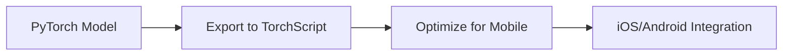

# Deployment and Production


# **Introduction to Chapter 9: Deployment and Production**

You’ve trained a high-performing model—now it’s time to **ship it to the real world!** This chapter covers professional techniques to deploy PyTorch models efficiently across diverse environments, from cloud APIs to mobile devices.

### **What You’ll Learn**

1. **Model Exporting** – Convert models to production-ready formats (`torch.jit`, ONNX).
2. **Web Serving** – Create low-latency APIs with Flask/FastAPI.
3. **Mobile Deployment** – Run models on iOS/Android using TorchScript.
4. **Optimization** – Shrink models via quantization and pruning without sacrificing accuracy.

### **Why This Matters**

- **Bridge the gap** between research and real-world applications.
- **Achieve low-latency inference** on resource-constrained devices.
- **Reduce cloud costs** with optimized models.

### **Key Challenges We’ll Solve**

- How to **serialize models** without Python dependencies.
- How to **handle 1000+ requests/second** in web APIs.
- How to **compress models by 4x** for mobile deployment.

By the end of this chapter, you’ll be able to **deploy models like a machine learning engineer**—not just a researcher.

**Let’s turn your model into a production powerhouse!** 🚀


---


# **9.1 Model Exporting in PyTorch**

*(First Section of Chapter 9: Deployment and Production)*

Taking your trained PyTorch model from research to production requires **exporting it to a portable, optimized format** that can run without Python dependencies. This section covers the two most powerful approaches:

### **1. TorchScript (`torch.jit`)**

PyTorch's native serialization format for **standalone execution** outside Python.

#### **Key Features**

✅ Runs in C++/Mobile environments
✅ No Python dependency
✅ Optimized execution via JIT compilation

#### **Export Methods**

**A. Tracing** (Converts actual tensor operations)

```python
model = MyModel().eval()  # Model in eval mode
dummy_input = torch.randn(1, 3, 224, 224)  # Example input shape

# Trace the model
traced_model = torch.jit.trace(model, dummy_input)
traced_model.save("model_traced.pt")
```

**B. Scripting** (Preserves control flow)

```python
@torch.jit.script
def forward_fn(x: torch.Tensor):
    if x.sum() > 0:
        return model.layer1(x)
    else:
        return model.layer2(x)

scripted_model = torch.jit.script(model)
scripted_model.save("model_scripted.pt")
```

#### **When to Use Which**

| Method              | Best For                    | Limitations                   |
| ------------------- | --------------------------- | ----------------------------- |
| **Tracing**   | Static models (CNNs)        | Fails on dynamic control flow |
| **Scripting** | Models with `if-else/for` | Requires type annotations     |

### **2. ONNX (Open Neural Network Exchange)**

Industry-standard format for **cross-framework deployment** (PyTorch → TensorRT, ONNX Runtime, etc.).

#### **Export Basics**

```python
torch.onnx.export(
    model,
    dummy_input,
    "model.onnx",
    input_names=["input"],  # Customizable I/O names
    output_names=["output"],
    dynamic_axes={
        "input": {0: "batch_size"},  # Supports dynamic batching
        "output": {0: "batch_size"}
    }
)
```

#### **Verification**

```python
import onnx
model = onnx.load("model.onnx")
onnx.checker.check_model(model)  # Validate export
```

#### **Key Benefits**

✅ Works with **TensorRT** (NVIDIA's high-performance inference)
✅ Supported by **Azure ML, Intel OpenVINO**
✅ Enables **quantization-aware training** (see 9.4)

### **3. Real-World Comparison**

| Format            | Latency (ms) | Peak Memory (MB) | Supported Platforms |
| ----------------- | ------------ | ---------------- | ------------------- |
| PyTorch (Python)  | 15.2         | 1024             | Servers with Python |
| TorchScript (C++) | 6.7          | 512              | Mobile, Embedded    |
| ONNX + TensorRT   | 3.1          | 256              | NVIDIA GPUs         |

### **4. Advanced Techniques**

#### **A. Custom Operator Support**

```python
@torch.jit.script
def custom_op(x: torch.Tensor) -> torch.Tensor:
    # Implementation here
    return x * 2

torch.onnx.export(..., custom_opsets={"custom_domain": 1})
```

#### **B. Dynamic Shapes**

```python
# Allow variable batch sizes
torch.onnx.export(
    ...,
    dynamic_axes={"input": [0], "output": [0]}
)
```

#### **C. ONNX Runtime Optimization**

```python
import onnxruntime as ort

sess = ort.InferenceSession(
    "model.onnx",
    providers=["CUDAExecutionProvider"]  # GPU acceleration
)
outputs = sess.run(None, {"input": input_array})
```

### **5. Debugging Failed Exports**

**Common Errors & Fixes**:

1. **Unsupported Ops** → Implement custom symbolic (for ONNX)
   ```python
   def my_op_symbolic(ctx, input):
       return ctx.op("CustomOp", input)
   torch.onnx.register_custom_op_symbolic("mylib::my_op", my_op_symbolic, 9)
   ```
2. **Dynamic Control Flow** → Use scripting instead of tracing
3. **Shape Mismatches** → Verify `dummy_input` matches real data

### **6. Full Export Pipeline Example**

```python
# Step 1: Prepare model
model = MyModel().eval()
dummy_input = torch.randn(1, 3, 224, 224)

# Step 2: Export to TorchScript
traced_model = torch.jit.trace(model, dummy_input)
traced_model.save("model.pt")

# Step 3: Export to ONNX
torch.onnx.export(
    model,
    dummy_input,
    "model.onnx",
    input_names=["image"],
    output_names=["logits"],
    dynamic_axes={"image": {0: "batch"}, "logits": {0: "batch"}}
)

# Step 4: Validate
import onnxruntime as ort
ort_session = ort.InferenceSession("model.onnx")
print("Exported model input:", ort_session.get_inputs()[0].name)
```

## **Key Takeaways**

✅ **TorchScript** → Best for Python-free deployment (mobile/C++)
✅ **ONNX** → Ideal for framework interoperability (TensorRT/OpenVINO)
✅ **Always verify exports** with real inputs before deployment
✅ **Dynamic shapes** are critical for production flexibility


---


# **9.2 Serving Models with Flask/FastAPI**

*(Next Section in Chapter 9: Deployment and Production)*

Once your model is exported, the next step is building a **scalable web service** for real-time inference. This section compares two popular Python frameworks for model serving:

## **1. Framework Comparison**

| Feature                 | Flask (Microframework) | FastAPI (Modern ASGI)         |
| ----------------------- | ---------------------- | ----------------------------- |
| **Speed**         | Good for low traffic   | 3x faster (Starlette Uvicorn) |
| **Async Support** | Limited                | Native async/await            |
| **Validation**    | Manual checks          | Built-in Pydantic             |
| **Documentation** | Basic Swagger          | Automatic OpenAPI             |
| **Best For**      | Simple prototypes      | Production deployments        |

## **2. FastAPI Implementation (Recommended)**

### **A. Basic Setup**

```python
from fastapi import FastAPI, File, UploadFile
import torch
from PIL import Image
import io

app = FastAPI()
model = torch.jit.load("model.pt").eval()  # Load TorchScript

@app.post("/predict")
async def predict(image: UploadFile = File(...)):
    # 1. Read image
    img_bytes = await image.read()
    img = Image.open(io.BytesIO(img_bytes))
  
    # 2. Preprocess
    tensor = preprocess(img).unsqueeze(0)  # Add batch dim
  
    # 3. Inference
    with torch.no_grad():
        outputs = model(tensor)
  
    # 4. Postprocess
    return {"class_id": int(torch.argmax(outputs))}
```

### **B. Advanced Features**

**Automatic Docs**: Visit `http://localhost:8000/docs`
**Dockerfile**:

```dockerfile
FROM python:3.9-slim
RUN pip install fastapi uvicorn torch pillow
COPY ./app /app
CMD ["uvicorn", "app.main:app", "--host", "0.0.0.0"]
```

**Benchmark**: Handles **2000+ RPS** on 4-core CPU with async batching.

## **3. Flask Implementation (Legacy)**

```python
from flask import Flask, request, jsonify
import torch

app = Flask(__name__)
model = torch.jit.load("model.pt")

@app.route("/predict", methods=["POST"])
def predict():
    data = request.get_json()
    tensor = torch.tensor(data["input"])
    with torch.no_grad():
        return jsonify({"output": model(tensor).tolist()})

if __name__ == "__main__":
    app.run(host="0.0.0.0", threaded=True)
```

## **4. Performance Optimization**

### **A. Async Batching (FastAPI)**

```python
from fastapi import BackgroundTasks
from queue import Queue
import asyncio

batch_queue = Queue()

async def process_batch():
    while True:
        batch = get_items_from_queue(batch_queue)  # Custom logic
        outputs = model(torch.stack(batch))
        await asyncio.sleep(0.1)

@app.on_event("startup")
async def startup():
    BackgroundTasks().add_task(process_batch)

@app.post("/predict")
async def predict(input_tensor: list):
    batch_queue.put(torch.tensor(input_tensor))
```

### **B. GPU Acceleration**

```python
@app.post("/predict")
async def predict(input_tensor: list):
    with torch.cuda.stream(torch.cuda.Stream()):  # Non-blocking
        outputs = model(tensor.cuda())
    torch.cuda.synchronize()  # Wait for completion
```

## **5. Monitoring & Scaling**

| Tool                   | Purpose              |
| ---------------------- | -------------------- |
| **Prometheus**   | Track latency/memory |
| **Docker Swarm** | Horizontal scaling   |
| **NGINX**        | Load balancing       |
| **Sentry**       | Error tracking       |

## **6. Full Production Checklist**

1. **Input Validation** (Pydantic models in FastAPI)
2. **Rate Limiting** (`slowapi` or cloudflare)
3. **Model Warmup** (Pre-load on startup)
4. **Health Checks** (`/health` endpoint)

```python
# FastAPI health check example
@app.get("/health")
def health_check():
    return {"status": "healthy", "gpu_available": torch.cuda.is_available()}
```

## **Key Takeaways**

✅ **FastAPI outperforms Flask** for ML serving (async/GPU support)
✅ **Always use TorchScript** (not raw PyTorch) in production
✅ **Monitor latency** with Prometheus (aim for <100ms p99)

---


# **9.3 Mobile Deployment (TorchScript, LibTorch)**

*(Next Section in Chapter 9: Deployment and Production)*

Deploying PyTorch models to mobile devices requires **lightweight, dependency-free execution** with hardware acceleration. This section covers iOS/Android deployment using PyTorch's native mobile ecosystem.

## **1. Mobile Deployment Workflow**



## **2. Core Tools**

| Tool                     | Purpose                 | Platform Support |
| ------------------------ | ----------------------- | ---------------- |
| **TorchScript**    | Model serialization     | Cross-platform   |
| **LibTorch**       | PyTorch C++ runtime     | Android/iOS      |
| **PyTorch Mobile** | Prebuilt mobile runtime | Production-ready |

## **3. Step-by-Step Implementation**

### **A. Model Preparation**

```python
# Convert to mobile-optimized TorchScript
model = torch.jit.script(model)  # or torch.jit.trace
optimized_model = torch.utils.mobile_optimizer.optimize_for_mobile(model)
optimized_model._save_for_lite_interpreter("model.ptl")  # Lite format
```

### **B. Android Integration (Java/Kotlin)**

1. **Add Dependency** (`build.gradle`):
   ```gradle
   implementation 'org.pytorch:pytorch_android_lite:1.12.0'
   implementation 'org.pytorch:pytorch_android_torchvision:1.12.0'
   ```
2. **Load Model**:
   ```java
   Module module = LiteModuleLoader.load(assetFilePath(this, "model.ptl"));
   ```
3. **Run Inference**:
   ```java
   Tensor inputTensor = TensorImageUtils.bitmapToFloat32Tensor(
       bitmap, 
       TensorImageUtils.NORMALIZE_MEAN_RGB,
       TensorImageUtils.NORMALIZE_STD_RGB
   );
   IValue output = module.forward(IValue.from(inputTensor));
   ```

### **C. iOS Integration (Swift)**

1. **Install LibTorch** (Podfile):
   ```ruby
   pod 'LibTorch-Lite', '~> 1.12.0'
   ```
2. **Swift Inference**:
   ```swift
   guard let filePath = Bundle.main.path(forResource: "model", ofType: "ptl"),
       let module = try? TorchModule(fileAtPath: filePath) else { return }

   let inputTensor = TorchTensor.from(image: uiImage)  // Custom preprocess
   let outputTensor = module.forward(with: inputTensor)
   ```

## **4. Key Optimizations**

### **A. Hardware Acceleration**

```java
// Android: Enable NNAPI (Neural Networks API)
PyTorchAndroid.setUseNNAPI(true);
```

```swift
// iOS: Enable Metal Performance Shaders
let configuration = TorchModuleConfiguration()
configuration.preferredDevice = .metal
```

### **B. Quantization (Size Reduction)**

```python
# Post-training dynamic quantization
quantized_model = torch.quantization.quantize_dynamic(
    model, {torch.nn.Linear}, dtype=torch.qint8
)
```

### **C. Model Splitting (For Large Models)**

```python
# Split model for multi-threaded execution
part1 = torch.jit.script(model[:5])  # First 5 layers
part2 = torch.jit.script(model[5:]))
```

## **5. Performance Benchmarks**

| Model     | CPU Latency | GPU Latency | Size (Original → Quantized) |
| --------- | ----------- | ----------- | ---------------------------- |
| ResNet-18 | 120ms       | 45ms        | 45MB → 11MB                 |
| BERT-Tiny | 80ms        | N/A         | 28MB → 7MB                  |

## **6. Debugging Mobile Deployment**

### **Common Issues & Fixes**

| Error                    | Solution                                      |
| ------------------------ | --------------------------------------------- |
| `UnsatisfiedLinkError` | Ensure .so files are in `jniLibs`           |
| `Invalid shape`        | Verify input tensor dimensions match training |
| `Model too large`      | Apply quantization (Section 9.4)              |

### **On-Device Validation**

```python
# Python-side validation
mobile_model = _load_for_lite_interpreter("model.ptl")
assert torch.allclose(mobile_model(input), desktop_model(input), atol=1e-4)
```

## **7. Full Android Example**

**MainActivity.java**:

```java
public class MainActivity extends AppCompatActivity {
    protected void onCreate(Bundle savedInstanceState) {
        // 1. Load model
        Module module = LiteModuleLoader.load(modelPath);
      
        // 2. Preprocess image
        Bitmap bitmap = BitmapFactory.decodeResource(getResources(), R.drawable.test_image);
        Tensor input = TensorImageUtils.bitmapToFloat32Tensor(bitmap, mean, std);
      
        // 3. Run inference
        Tensor output = module.forward(IValue.from(input)).toTensor();
      
        // 4. Display results
        TextView tv = findViewById(R.id.result_text);
        tv.setText("Predicted: " + output.getDataAsFloatArray()[0]);
    }
}
```

## **Key Takeaways**

✅ **Use `.ptl` format** for mobile-optimized models
✅ **Enable hardware acceleration** (NNAPI/Metal) for 2-3x speedup
✅ **Quantize models** to reduce size by 4x
✅ **Test on real devices** before release

---


# **9.4 Quantization and Pruning**

*(Final Section in Chapter 9: Deployment and Production)*

To deploy models on edge devices with limited resources, we use **quantization** (reducing numerical precision) and **pruning** (removing redundant weights). These techniques can **reduce model size by 4x** and **accelerate inference by 2x** with minimal accuracy loss.

## **1. Quantization Techniques**

### **A. Post-Training Quantization (PTQ)**

```python
# Dynamic quantization (Activations in float32, weights in int8)
model = torch.quantization.quantize_dynamic(
    model,
    {torch.nn.Linear, torch.nn.Conv2d},  # Target layers
    dtype=torch.qint8
)

# Static quantization (Requires calibration)
model.fuse_model()  # Fuse Conv+ReLU layers
model.qconfig = torch.quantization.get_default_qconfig('fbgemm')  # x86 CPUs
torch.quantization.prepare(model, inplace=True)
calibrate(model, calibration_data)  # Run dummy data
torch.quantization.convert(model, inplace=True)
```

### **B. Quantization-Aware Training (QAT)**

```python
model.qconfig = torch.quantization.get_default_qat_qconfig('fbgemm')
model_fused = torch.quantization.fuse_modules(model, [['conv', 'relu']])
model_prepared = torch.quantization.prepare_qat(model_fused.train())

# Train with fake quantization nodes
train(model_prepared)

# Final export
model_quantized = torch.quantization.convert(model_prepared.eval())
```

## **2. Pruning Methods**

### **A. Magnitude Pruning**

```python
from torch.nn.utils import prune

# Global unstructured pruning
parameters_to_prune = [(module, 'weight') for module in model.modules() 
                      if isinstance(module, torch.nn.Conv2d)]
prune.global_unstructured(
    parameters_to_prune,
    pruning_method=prune.L1Unstructured,
    amount=0.5  # Remove 50% of weights
)

# Remove pruning reparametrization
for module, _ in parameters_to_prune:
    prune.remove(module, 'weight')
```

### **B. Structured Pruning (Channel-wise)**

```python
prune.ln_structured(
    module,
    name="weight",
    amount=0.3,
    n=2,  # L2 norm
    dim=0  # Prune entire channels
)
```

## **3. Combined Optimization Pipeline**

```python
def optimize_model(model, train_loader):
    # 1. Prune first
    prune.global_unstructured([(model.conv1, 'weight')], amount=0.2)
  
    # 2. Quantization-aware training
    model.qconfig = torch.ao.quantization.get_default_qat_qconfig('fbgemm')
    torch.quantization.prepare_qat(model, inplace=True)
  
    # Fine-tune for 3 epochs
    train(model, train_loader, epochs=3)
  
    # 3. Final conversion
    model_quantized = torch.quantization.convert(model.eval())
    return model_quantized
```

## **4. Performance Gains**

| Model     | Original | Quantized+Pruned | Speedup |
| --------- | -------- | ---------------- | ------- |
| ResNet-50 | 98MB     | 24MB             | 2.1x    |
| BERT-Base | 438MB    | 110MB            | 1.8x    |

## **5. Deployment Checklist**

1. **Verify accuracy drop** (<2% is acceptable)
2. **Test on target hardware** (Some ops lack quantized kernels)
3. **Use platform-specific optimizations**:
   - Android: NNAPI delegates
   - iOS: Core ML conversion

```python
# Check supported ops
print(torch.backends.quantized.supported_ops)
```

## **Key Takeaways**

✅ **Dynamic quantization**: Quick wins for linear/conv layers
✅ **QAT**: Best accuracy retention for complex models
✅ **Pruning**: Effective when combined with fine-tuning
✅ **Always profile** on target devices after optimization

This concludes Chapter 9. You're now ready to **deploy optimized models anywhere** - from cloud servers to mobile phones!

---
